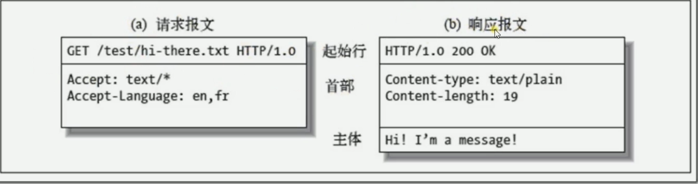
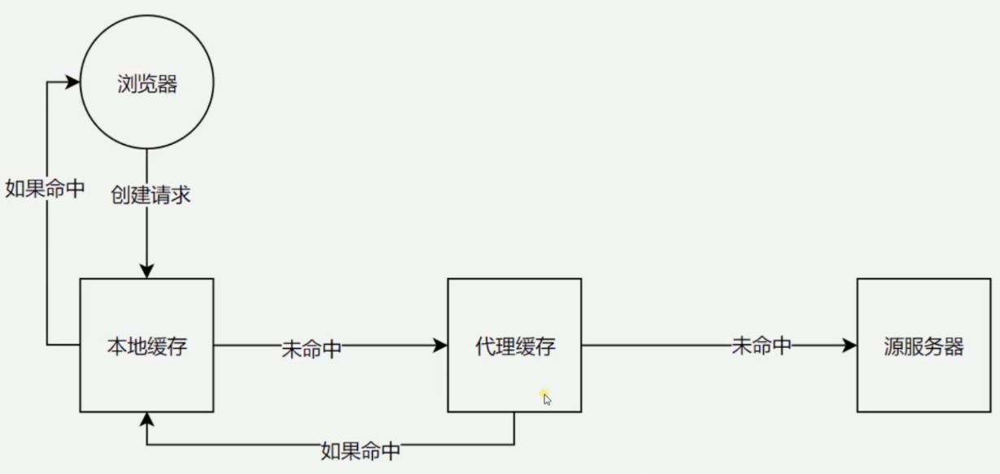
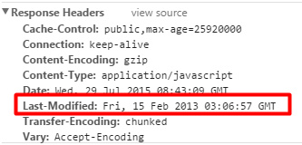
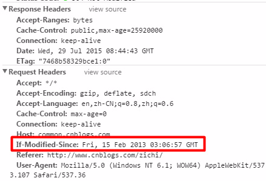
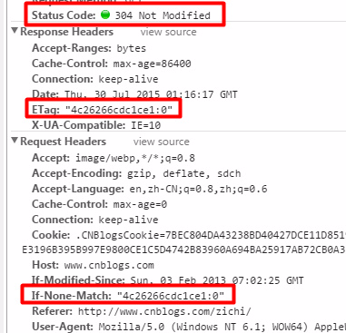
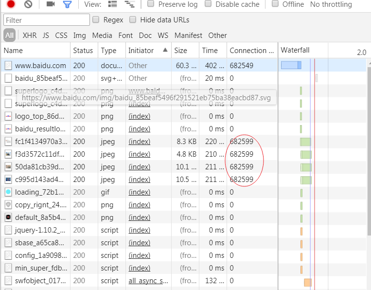
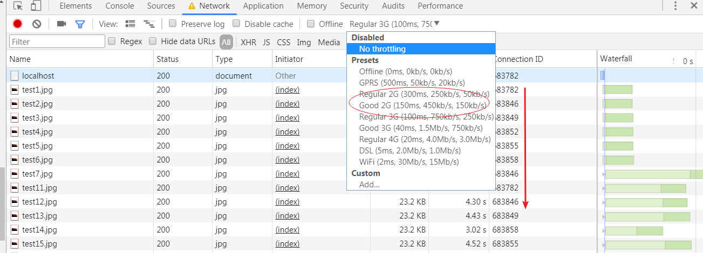

## 第2章 HTTP协议基础及发展历史

### 2-1 5层网络模型介绍

- 物理层：物理设置之间的数据传输（硬件设备）

- 数据链路层：通信实体间建立数据链路连接（硬件和电脑）

- 网络层：数据再节点之间传输逻辑链路（创建HTTP协议-电脑和电脑）
  IP协议、ARP协议（识别mac地址）

- 传输层：建立端口到端口的通信，实现程序之间的交流
  UDP协议、TCP协议

- 应用层：规定应用程序的数据格式

### 2-2 HTTP协议的发展历史

#### http/0.9: 

只有一个命令get，没有header，服务器发送完毕就关闭TCP链接

#### http/1.0：

增加 post、heaader命令；

增加 content-type字段，数据格式；

增加 content-encoding字段，数据压缩方法。

**缺点：每一个TCP连接只能发送一个请求**

#### http/1.1

增加 持久连接：Conection: keep-alive （复用TCP连接）

增加 管道机制（pipelining）：同时发送多个请求，根据发送顺序回应请求

增加 Content-length和分块传输代码

增加 hot字段指定服务器域名，增加请求命令

**缺点：一个TCP连接可以发送多个请求，所有的数据通信是按次序进行的。服务器只有处理完一个回应，才会进行下一个回应。行成阻塞**

#### http/2.0

1、所有数据二进制传输

2、多工

服务器同时收到了A请求和B请求，于是先回应A请求，结果发现处理过程非常耗时，于是就发送A请求已经处理好的部分，接着回应B请求，完成后，再发送A请求剩下的部分。

在一个连接里，客户端和浏览器都可以同时发送多个请求或回应，而且不用按照顺序一一对应，这样就避免了"队头堵塞"

3、头信息压缩

HTTP 协议不带有状态，每次请求都必须附上所有信息。使用gzip或compress压缩后再发送

4、服务器推送

服务器未经请求，主动向客户端发送资源

### 2-3 HTTP的三次握手，四次挥手

**三次挥手**：创建TCP，确认双方收发信息功能正常


1、第一次握手:（喂，你听的到么）

浏览器发完数据后，发送FIN请求断开连接。``syn=1;seq=a;``

2、第二次握手：（喂，我听得到，你呢？）

服务器发送ACK表示同意，确定没有数据发送了，``syn=1;seq=b;ACK=a+1``

3、第三次握手：（我也听得到...）

确认客户端能够接收到数据 ``seq=a+1;ACK=b+1``

**四次挥手：**  终止TCP连接

1、 客户端发送FIN：告诉不再发送数据 ``Fin=1;seq=a;ACK=B``

2、 服务器发送FIN：告诉我知道了，但客户端还能接受数据，服务器还未发送完数据 ``Fin=1;seq=b;ACK=a+1``

3、 服务器再次发送FIN：告诉不再发送数据，可以关闭连接了 ``Fin=1;seq=b;ACK=a+1``

4、 客户端主动关闭连接，服务器被动关闭连接 ``seq=a+1;ACK=b+1``

**区别：** 
创建连接时，服务器把ACK和SYN放在一个报文里发送到客户端。关闭连接时，服务器考虑到数据未传完，将ACK和FIN分开发送


### 2-4 URI、URL、URN

URI: 统一资源标识符。用来唯一标识资源，包含URL和URN

URL：统一资源定位器。

URN：永久统一资源定位符。内容地址变化也能找到

### 2-5 HTTP报文格式




## 第3章 HTTP各种特性总览

### CORS跨域请求的限制与解决

```js
// server1.js
const http = require("http");
const fs = require("fs");

http
  .createServer(function(request, response) {
    console.log("request come", request.url);

    const html = fs.readFileSync("test.html", "utf8");
    response.writeHead(200, {
      "Content-Type": "text/html"
    });
    response.end(html);
  })
  .listen(8888);

console.log("on 8888");

// server2.js
const http = require("http");

http
  .createServer(function(request, response) {
    console.log("request", request.url);

    response.writeHead(200, {
      // 允许任何地址访问
      'Access-Control-Allow-Origin':'*'
    })

    response.end("123");
  })
  .listen(8887);

console.log("on 8887");

// html
<script>
  var xhr = new XMLHttpRequest();
  xhr.open("GET", "http://127.0.0.1:8887");
  xhr.send();
</script>

// 处理跨域使用jsonp方法，创建script标签进行访问
```

### CORS跨域限制以及预请求验证

#### 预请求：通过预请求获得服务器的认可，再发送实际的请求

跨域请求除去以下默认，其他方式都要通过预请求：

1、默认允许方法：GET、HEAD、POST

2、默认允许Content-Type：text/plain、multipart/form-data、x-www-form-urlencoded

3、请求头限制

```js
    response.writeHead(200, {
      "Access-Control-Allow-Origin": "*",
      // 允许请求头范围
      "Access-Control-Allow-Headers": "X-Test-Cors",
      // 允许请求方法
      "Access-Control-Allow-Methods": "POS, PUT, DELETE",
      // 产生预请求后，时间范围内不需要再次发送预请求
      "Access-Control-Max-Age": "1000"
    }); 
```

### 3-4 缓存头Cache-Control的含义和使用

Expires规定了缓存失效时间

Cache-Control的max-age规定了缓存有效时间

规定如果Cache-Control和Expires同时存在，前者优先级高于后者

```js
response.writeHead(200, {
  "Content-Type": "text/javascript",
  'Cache-Control': 'max-age=200'
});
response.end('console.log("script loaded")');
response.end('console.log("new script loaded")');
```

max-age存在一个问题：当服务器资源更新，但缓存有效时间还没到，浏览器只会读取缓存，导致无法获取最新的服务器数据

### 3-5 缓存验证Last-Modified和Etag的使用



1、Last-Modified 与 If-Modified-Since(检查文件修改时间)

比如第一次访问我的主页simplify the life，会请求一个文件，响应头返回如下信息：



然后在主页按下ctrl+r刷新，ctrl+r会默认跳过max-age和Expires的检验直接去向服务器发送请求



请求头中的If-Modified-Since的日期和服务端该文件的最后修改日期对比，如果相同，则响应HTTP返回304，从缓存读数据；

如果文件更新了，HTTP返回200，同时响应头更新last-Modified的值（以备下次对比）

2、Etag 与 If-None-Match(检查文件修改后的版本号)

ETag并不是文件的版本号，而是一串可以代表该文件唯一的字符串（文件的索引节，大小和最后修改时间进行Hash后得到的）

当客户端发现和服务器约定的直接读取缓存的时间过了，就在请求中发送If-None-Match选项，值即为上次请求后响应头的ETag值。

该值和服务端存有的数字对比（如果服务端该文件改变了，该值就会变），如果相同，则相应HTTP304，客户端直接读取缓存，如果不相同，HTTP200，下载正确的数据，更新ETag值。



如果两者同时存在，If-None-Match/ETag优先，忽略Last-Modified/If-Modified-Since

HTTP1.1中ETag的出现主要是为了解决几个Last-Modified比较难解决的问题：

* Last-Modified标注的最后修改只能精确到秒级，如果某些文件在1秒钟以内，被修改多次的话，它将不能准确标注文件的修改时间

* 如果某些文件会被定期生成，但有时内容并没有任何变化（仅仅改变了时间），但Last-Modified却改变了，导致文件没法使用缓存

* 有可能存在服务器没有准确获取文件修改时间，或者与代理服务器时间不一致等情形

### 3-6 cookie和session

1、cookie：记录用户信息

通过cookie来实现Session跟踪；

保存账号，参数

属性：
- max-age 和 expires
- Secure只在https的时候发送
- httpOnly设置后无法通过document.cookies访问

```js
response.writeHead(200, {
  "Content-Type": "text/html",
  "Set-Cookie": [
    "id=123; max-age=2;domain=test.com",
    "abc=456;HttpOnly"
  ]
});
```

2、session: 跟踪用户信息

服务器在cookie中记录一个sessionId，每次请求都会把ID传给服务器进行识别。

### 3-7 HTTP长连接

相同的Connection ID表明是同一个TCP链接，同时最多有6个。

若还有更多的TCP连接，必须得等到前面的连接结束

所以长连接（Connection: keep-alive）的作用：复用TCP连接。





- http请求是在TCP连接上发送的，一个TCP链接可以发送多个HTTP请求

- 在http1.1中，一个TCP连接上发送多个请求是有先后顺序

- 在http2中，一个TCP连接上可以并发发送多个请求，有时候只开一个TCP连接就足够了


### 3-8 数据协商

浏览器：

- Accept: 告诉接收的数据类型

- Accept-Encoding: 数据压缩方式

- Accept-Language: 数据语言

- User-Agent: PC、移动端

服务器：

- Content-Type: 返回的数据格式

- Content-Encoding: 返回数据压缩方式 gzip
  
- Content-Language: 返回数据语言


```js

/* <form action="/form" id="form" enctype="application/x-www-form-urlencoded">
  <input type="text" name="name">
  <input type="password" name="password">
  <input type="file" name="file">
  <input type="submit">
</form> */

enctype="application/x-www-form-urlencoded"
// 返回数据格式是 Form data {name=1&password=2}

enctype="multipart/form-data"
// 上传文件时，将传输的数据改为二进制形式
// ```
// Content-Disposition: form-data; name="name
// ```
```

### 3-9 Redirect

资源换了位置，重定向新的地址
```js
// 302 表示路径临时跳转
// 301 表示路径永久跳转（跳转一次后，直接跳转到的新的，无需服务器再重新指定，此时已存在浏览器缓存中，且没有过期时间）

if (request.url === '/') {
  response.writeHead(302, {  // or 301
    'Location': '/new' // 同域跳转不用指明协议端口
  })
  response.end()
}
if (request.url === '/new') {
  response.writeHead(200, {
    'Content-Type': 'text/html',
  })
  response.end('<div>this is content</div>')
}
```

### 3-10 CSP（内容安全策略）

1、使用白名单的方式告诉客户端（浏览器）允许加载和不允许加载的资源。

2、向服务器举报行为，以便做出更加针对性的措施予以绝杀。

资源类型: img-src style-src srcipt-src ...

```js
response.writeHead(200, {
  "Content-Type": "text/html",
  "Content-Security-Policy": "default-src http: https:"
});
```

## 第4章 第4章 Nginx代理以及面向未来的HTTP

### 4-1 Nginx安装和基础代理配置


### 4-2 Nginx代理配置和代理缓存的用处

### 4-3 HTTPS解析

### 4-4 使用Nginx部署HTTP服务

### 4-5 HTTP2的优势和Nginx配置HTTP2的简单使用

## 第5章 第5章 课程总结

### 5-1 课程总结